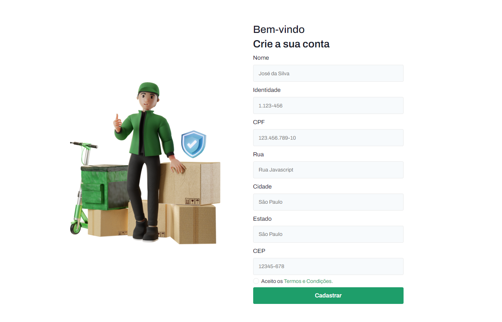
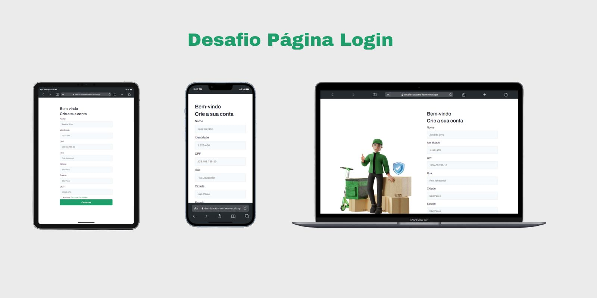

[](https://opensource.org/licenses/MIT)

#### Você pode acessar o projeto por aqui <a target="_blank" href="https://desafio-cadastro-fawn.vercel.app/">Página Cadastro.</a>


## 💻 Projeto

O projeto foi desenvolvido com a finalidade de cumprir o desafio proposto na comunidade Dev Iniciantes.

### Funcionalidades
- **Máscara no formulário**: os campos de Identidade, CPF e CEP estão com máscara para evitar o preenchimento incorreto dos dados.

- **Responsividade**: o layout do projeto se adapta a diversas telas de tamanhos diferentes.


### Conceitos praticados
- Responsividade.

- Aplicação de máscara nos campos do formulário com [jQuery Mask Plugin](https://igorescobar.github.io/jQuery-Mask-Plugin/).


## 🛠️ Techs:

[](https://skillicons.dev)


## 🚀 Quickstart

1. Clone o projeto:

   ```shell
   git clone git@github.com:Raul-Albuquerque/desafio-pagina-cadastro.git
   ```

2. Acesse a pasta do seu projeto:

   ```shell
   cd <nomedapastadoprojeto>
   ```

2. Abra o Visual Studio Code:

   ```shell
   code .
   ```

## 📊 Status

O status atual do projeto é: "completo"✅.

## 👨🏻‍💻 Autor

Esse projeto foi criado por [Raul Albuquerque](https://github.com/Raul-Albuquerque).